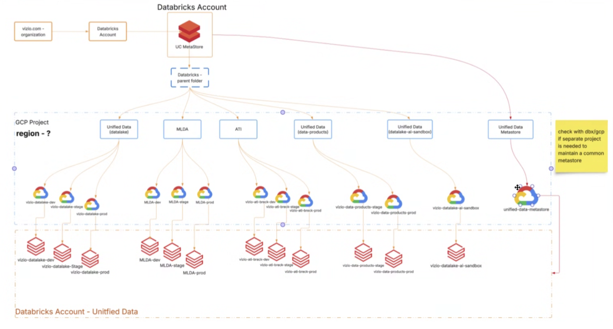
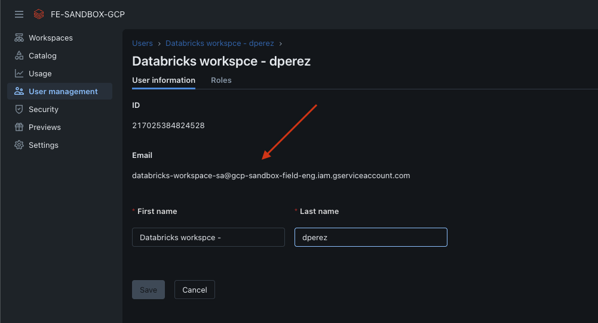

# Databricks Workspaces Deployment for Vizio Azure → GCP Migration

This Terraform project is intended for use in the Vizio migration to deploy all the workspaces required to support the Azure migration to GCP. This Terraform script was designed to ensure that we can deploy any number of workspaces in a single Terraform execution, allowing end users to provide the necessary settings per workspace before the code is triggered, as well as the users, groups and service principals assigned to each workspace project.

This Terraform code comes in two different flavors:

- **full** – creates everything from scratch
- **workspace_only** – maps existing cloud resources to new Databricks workspaces

Based on the gathered requirements, the cloud resources will already exist, so we only need to map them accordingly to each workspace. We can supply the `project_id`, `VPC`, `subnet`, and `VPC endpoints` if private link is required.  

In this case, `workspace_only` is the mode we need to use when running this Terraform script.



## Description

This template will deploy the following resources:

### Full mode
- GCP VPC
- GCP VPC Firewall rules
- GCP Subnet
- Cloud NAT + Cloud Router
- Custom Databricks Service Accounts with required [GCP permissions](https://docs.databricks.com/gcp/en/admin/cloud-configurations/gcp/permissions)
- All resources from **Workspace-only** mode (listed below)

### Workspace-only mode
- Databricks workspaces
- Assignment of users, groups, and service principals per workspace
- Optional implementation of Backend and Frontend Private Service Connect endpoints (PrivateLink)

## Instructions

### 1. Prerequisites

Before running the Terraform project, ensure you have the following installed and configured:

- [Terraform](https://www.terraform.io/downloads.html) ≥ v1.0

### 2. Provider Authentication

#### GCP Provider Configuration

Authenticate using one of the following methods:

a. **Application Default Credentials (ADC)**  run:
```bash
gcloud auth application-default login
```

b. **Service Account Key** – set the `GOOGLE_CREDENTIALS` environment variable.

c. **Explicit Credentials** – provide `credentials_file` or `access_token`.

Ensure the principal running the Terraform code has the required [GCP Workspace Creator permissions](https://docs.databricks.com/gcp/en/admin/cloud-configurations/gcp/permissions).

---

### Databricks Provider Configuration for Account-Level Operations

This provider is used to create and manage the Databricks workspace.

Authenticate using one of the following methods:

a. **OAuth M2M (Machine-to-Machine)** – recommended for production. Set `DATABRICKS_CLIENT_ID` and `DATABRICKS_CLIENT_SECRET`.

b. **Databricks Account Credentials** – set `DATABRICKS_ACCOUNT_ID`, `DATABRICKS_CLIENT_ID`, and `DATABRICKS_CLIENT_SECRET`.

c. **GCP Service Account** for Databricks provisioning and authentication with the Databricks Account API.

For simplification, we’ll use option **C**: adding a service account and manually registering it in the Accounts Console as an account admin.



### 3. Terraform execution

#### Populate the Terraform variables with the desired configuration for each workspace

This section allows you to define per-workspace settings and set the maximum number of parallel deployments. The module supports both Private Link–enabled and standard workspaces, automatically applying the appropriate logic based on your configuration.

Example without private link:

```

"workspace1" = {
    workspace_name                       = "dperez-dev-workspace"
    project_id                           = "gcp-sandbox-field-eng"
    region                               = "us-central1"
    vpc_name                             = "databricks-infra-vpc"
    subnet_name                          = "databricks-subnet"
    subnet_region                        = "us-central1" 
    workspace_service_account_email      = "databricks-workspace-sa@gcp-sandbox-field-eng.iam.gserviceaccount.com"  # REQUIRED in workspace_only mode
    enable_secure_cluster_connectivity   = true
    gcs_bucket_location                  = "US"
    allow_bucket_force_destroy           = false
    tags = {
      environment = "development"
      team        = "data-engineering"
      owner       = "danilo.deoliveiraperez@databricks.com"
    }

    # Workspace Admins - Users/Groups/Service Principals with ADMIN permissions
    workspace_admins = [
      {
        principal_name = "danilo.deoliveiraperez@databricks.com"
        type           = "user"
      },
      {
        principal_name = "data-engineering-team"
        type           = "group"
      }
    ]
    
    workspace_users = [
      {
        principal_name = "data-engineering-users"
        type           = "group"
      }
    ]
  }

```

Example with private link:

```

"workspace3" = {
    workspace_name                       = "dperez-secured-ws"
    project_id                           = "gcp-sandbox-field-eng"
    region                               = "us-central1"
    vpc_name                             = "dperez-vivo-proj"
    subnet_name                          = "db-subnet"
    subnet_region                        = "us-central1"
    workspace_service_account_email      = "databricks-workspace-sa@gcp-sandbox-field-eng.iam.gserviceaccount.com"  # REQUIRED in workspace_only mode
    enable_secure_cluster_connectivity   = true
    gcs_bucket_location                  = "US"
    allow_bucket_force_destroy           = false
    tags = {
      environment = "production"
      team        = "data-secured"
      owner       = "danilo.deoliveiraperez@databricks.com"
    }

    # GCP Private Service Connect (PSC) - Backend Private Link
    # Only works with workspace_only deployment mode
    enable_private_service_connect = true
    private_service_connect = {

      # Relay VPC Endpoint (REQUIRED for PSC) - name of GCP forwarding rule
      relay_endpoint_name       = "psc-dperez-dp-ngrok"
      relay_endpoint_project_id = "gcp-sandbox-field-eng"
      relay_endpoint_region     = "us-central1"
      
      # Workspace Backend VPC Endpoint (OPTIONAL for PSC) - name of GCP forwarding rule  
      workspace_endpoint_name       = "dperez-psc-endpoint-all-ports"
      workspace_endpoint_project_id = "gcp-sandbox-field-eng"
      workspace_endpoint_region     = "us-central1"
      
      # Private Access Settings
      public_access_enabled = true  # Set to false for fully private workspace ( https://docs.databricks.com/gcp/en/security/network/classic/private-access-settings#create-a-private-access-settings-object )
      private_access_level  = "ACCOUNT"  # ACCOUNT or ENDPOINT
    }

    # Workspace Admins - Users/Groups/Service Principals with ADMIN permissions
    workspace_admins = [
      {
        principal_name = "danilo.deoliveiraperez@databricks.com"
        type           = "user"
      },
      {
        principal_name = "data-engineering-team"
        type           = "group"
      }
    ]
    
    # Workspace Users - Users/Groups/Service Principals with USER permissions
    workspace_users = [
      {
        principal_name = "data-engineering-users" 
        type           = "group"
      }

    ]
  }

```

#### Execute the terraform code.

After completing the tfvars file, run terraform validate to ensure the configuration is syntactically correct, and then run terraform plan to review the execution plan. If everything looks good, you can safely proceed with applying the Terraform code


```
export GOOGLE_CREDENTIALS="./gcp-auth/gcp-sandbox-field-eng-0426cb3ab091.json"
terraform init
terraform validate
terraform plan
terraform apply
```